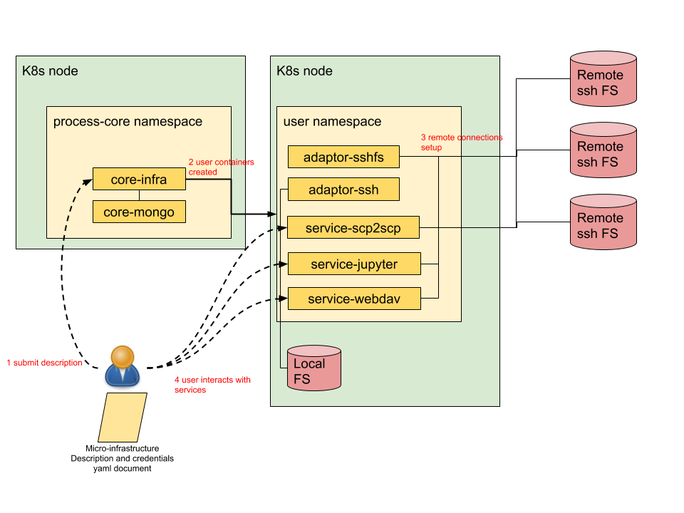

# Documentation

The LOBCDER micro-infrastructure is setup of many depending parts. Here we describe how each interact and how to make use of them. There are two main scenarios, 1: setting up a demo setup using local VMs (mini-lobcder) or setting up a full installation.  First we give an overview of the architecture.

## Architecture

The above figure illustrates the interactions of the main LOBCDER components and repositories. All the components run as pods in a Kubernettes cluster. The core services, core-infra and core-mongo, run in a process-core namespace. The user pods which make up the user's micro-infrastructure run in seperate namespace per user. User interact with the system by first submit a [micro-infra deployment file](https://github.com/micro-infrastructure/core-infra/blob/master/MICRO-INFRA.md) to [core-infra](https://github.com/micro-infrastructure/core-infra) service. The core-infra service translates the the micro-infra file to k8s deployment and service yaml descriptions, creates namespaces, secrets, credentials and submits them to the k8s cluster. This creates a pod with all the containers requested by the user.

A standard deployment involves attaching to remote HPC file systems using ssh/sshfs, expose these filesystems to the user using a webdav endpoint and deploy the [service-scp2scp](https://github.com/micro-infrastructure/service-scp2scp) API which is used by [IEEE]()
to do 3rd party copies between HPC clusters. 

A special case deployment is wen the k8s node is a DTN (Data Transfer Node) then containers can mount a local host folder E.g. [adaptor-ssh](https://github.com/micro-infrastructure/adaptor-ssh) mounts a local folder and exposes it through ssh. 

## Mini-LOBCDER
- [Mini-LOBCDER](https://github.com/micro-infrastructure/mini-lobcder/blob/master/README.md)
## User Documentation
- [User Documentation](user-docs.md)
## Installation Documentation
- [Installation Documentation](installation-docs.md)
## Core-infra API
- [Core-infra API reference](https://github.com/micro-infrastructure/core-infra/blob/master/API.md)
## Micro-infra yaml description file
- [Micro-infrastructure yaml description reference](https://github.com/micro-infrastructure/core-infra/blob/master/micro-infra.md)
## Micro-infra custom container
- [Micro-infrastrucutre custom container howto](https://github.com/micro-infrastructure/core-infra/blob/master/custom-container.md)
## Service-scp2scp API reference
- [Service-scp2scp API reference](https://github.com/micro-infrastructure/service-scp2scp/blob/master/API.md)
## LOFAR Documentation
- [LOFAR-specific Documentation](lofar-docs.md)
 

